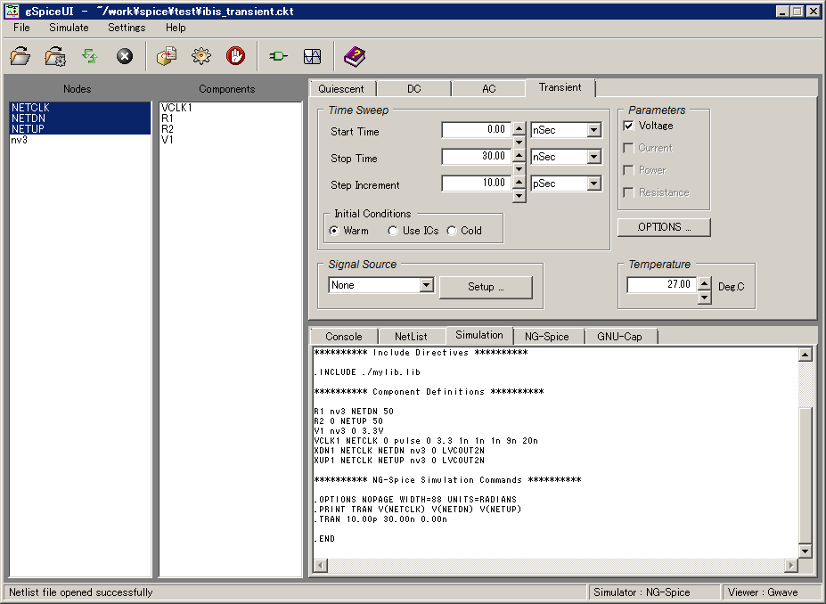
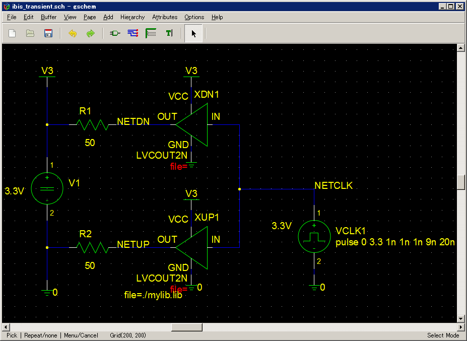

# gEDA for Windows plus gSpiceUI
[日本語](./README_JP.md)

## Overview
Windows port of [gEDA Project](http://www.geda-project.org/ ).
Draw schematics, do SPICE simulations and view simulation results on MS-Windows.

This uses the following projects:

* **gEDA for Windows:** [gEDA for MS-Windows page](http://bibo.iqo.uni-hannover.de/dokuwiki/doku.php?id=english:geda_for_ms-windows ) (Pre-built binaries: `geda-20130122.zip`)
* **gSpiceUI:** [Mike Waters's GNU SPICE GUI page](http://users.tpg.com.au/micksw012/gspiceui.html ) (Documents),  [sourceforge](https://sourceforge.net/p/gspiceui/code/HEAD/tree/trunk/ ) (Source code: `trunk r275`)
* **NGSpice:** [Ngspice project](https://sourceforge.net/projects/ngspice/files/ng-spice-rework/old-releases/26/ ) (Source code: `ngspice-26.tar.gz`)
* **Gnucap:** [GPL'd Electronic Design Automation](https://osdn.net/projects/sfnet_geda/releases/ ) (Source code: `Gnucap-2009-12-07.tar.gz`)

## How to Install
1. [required] Download the project : `[Clone or download] - [Download ZIP]`
1. [required] Unzip the file into any folder you like.
1. [required] Execute `pixbuf.cmd` once after you unzip the file. Also you should do this when you move the folder to another.
1. [optional] Copy contents of USERPROFILE subfolder to your HOME folder (usually `%USERPROFILE%`). Edit the copied files if necessary.

## How to Use
* **gschem** : double click `run_gschem.cmd` icon.
* **gSpiceUI** : double click `run_gSpiceUI.cmd` icon.
* **Other tools** : run `gedavars.cmd` on command prompt or double click `geda_console.cmd`, then invoke any tool in the command prompt.

Please refer each project home page for individual usage.

## Config Files
__gSpiceUI__ creates the following config file.

    %USERPROFILE%\.gspiceui.conf

If you want to reset gSpiceUI settings, delete the above config file.

__gschem__ creates the following config files.

    %USERPROFILE%\.gEDA
    %USERPROFILE%\.pcb
    %USERPROFILE%\AppData\Local\gEDA\geda-user.conf

Creating files `gschemrc` and `gafrc` allows you to customize  __gschem__ and __gnetlist__ behavior with your own settings. These files should be written in  __guile__ script.

These config files define *user global settings* when you put them in `%USERPROFILE%\.gEDA` folder.

These files define *project only settings* when you put them in the project folder.

    .gEDA\gschemrc example:
    ; disable auto-saving
    (auto-save-interval 0)
    
    .gEDA\gafrc example:
    (component-library "C:\\Users\\USER\\.gEDA\\local_symbols" "Local Symbols")

Your own symbol library files (.sym) are recommended to place in `local_symbols` subfolder in `%USERPROFILE%\.gEDA` folder.

---
kitanokitsune / 北乃きつね
